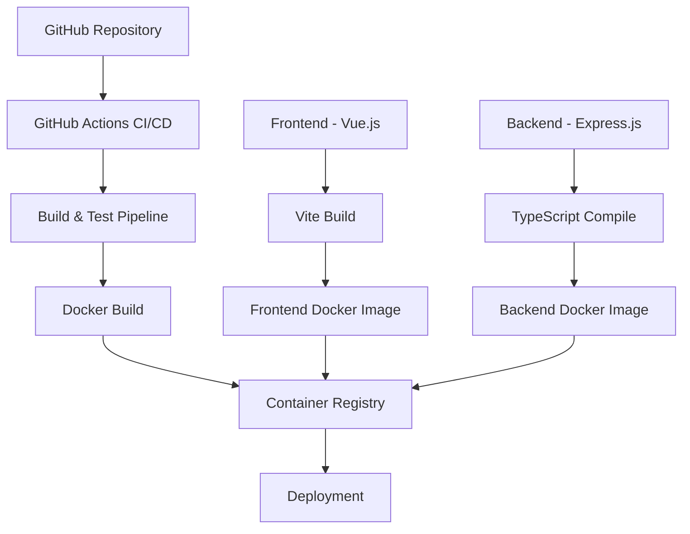
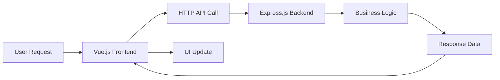

## Product Overview

A monorepo TypeScript full-stack project featuring a Vue.js frontend and Express.js backend with complete CI/CD automation. The project includes GitHub Actions workflows for automated testing, building, and Docker containerization deployment.

## Core Features

- Vue.js frontend with TypeScript support and modern development tooling
- Express.js backend API with TypeScript configuration
- Monorepo structure for unified codebase management
- GitHub Actions CI/CD pipeline with automated testing and building
- Docker containerization for both frontend and backend services
- Automated deployment workflow with container registry integration

## Tech Stack Selection

- **Frontend**: Vue.js 3 with TypeScript, Vite build tool
- **Backend**: Express.js with TypeScript, Node.js runtime
- **Package Management**: npm workspaces for monorepo structure
- **CI/CD**: GitHub Actions workflows
- **Containerization**: Docker with multi-stage builds
- **Testing**: Vitest for frontend, Jest for backend

## System Architecture



### Module Division

- **Frontend Module**: Vue.js application with TypeScript, component library, routing, and state management
- **Backend Module**: Express.js API server with TypeScript, middleware, routes, and database integration
- **Shared Module**: Common TypeScript types and utilities shared between frontend and backend
- **CI/CD Module**: GitHub Actions workflows for testing, building, and deployment automation
- **Docker Module**: Containerization configurations for both services

### Data Flow



## Implementation Details

### Core Directory Structure

```
typescript-fullstack-cicd/
├── packages/
│   ├── frontend/           # Vue.js application
│   │   ├── src/
│   │   ├── public/
│   │   ├── package.json
│   │   ├── vite.config.ts
│   │   └── Dockerfile
│   ├── backend/            # Express.js API
│   │   ├── src/
│   │   ├── package.json
│   │   ├── tsconfig.json
│   │   └── Dockerfile
│   └── shared/             # Shared TypeScript types
│       ├── src/
│       └── package.json
├── .github/
│   └── workflows/          # CI/CD workflows
├── docker-compose.yml      # Local development
├── package.json            # Root workspace config
└── README.md
```

### Key Code Structures

**Shared Types Interface**: Defines common data structures used across frontend and backend to ensure type safety and consistency in API communication.

```typescript
// Shared API types
export interface ApiResponse<T> {
  success: boolean;
  data: T;
  message?: string;
}

export interface User {
  id: string;
  name: string;
  email: string;
}
```

**Express Server Setup**: Main server configuration with TypeScript support, middleware setup, and API route definitions.

```typescript
// Backend server structure
import express from 'express';
import cors from 'cors';

const app = express();
app.use(cors());
app.use(express.json());

app.get('/api/health', (req, res) => {
  res.json({ success: true, message: 'Server is running' });
});
```

### Technical Implementation Plan

#### 1. Monorepo Setup

- **Problem**: Configure npm workspaces for unified dependency management
- **Solution**: Root package.json with workspaces configuration and shared dependencies
- **Implementation Steps**:

1. Initialize root package.json with workspaces field
2. Create packages directory structure
3. Configure shared TypeScript configuration
4. Set up cross-package dependency linking

#### 2. CI/CD Pipeline Design

- **Problem**: Automate testing, building, and deployment processes
- **Solution**: GitHub Actions workflows with matrix builds and Docker integration
- **Implementation Steps**:

1. Create workflow for pull request validation
2. Implement build and test automation
3. Configure Docker image building and pushing
4. Set up deployment triggers and environment management

#### 3. Docker Containerization

- **Problem**: Consistent deployment across environments
- **Solution**: Multi-stage Docker builds for optimized production images
- **Implementation Steps**:

1. Create Dockerfiles for frontend and backend
2. Implement multi-stage builds for size optimization
3. Configure docker-compose for local development
4. Set up container registry integration

### Integration Points

- **API Communication**: RESTful HTTP APIs with JSON data exchange
- **Type Sharing**: npm workspace linking for shared TypeScript definitions
- **Build Integration**: Coordinated build processes through GitHub Actions
- **Container Orchestration**: Docker Compose for local development, container registry for production

## Technical Considerations

### Performance Optimization

- Frontend code splitting and lazy loading with Vite
- Backend response caching and compression middleware
- Docker image layer optimization and multi-stage builds
- CI/CD pipeline caching for faster build times

### Security Measures

- Environment variable management for sensitive configuration
- CORS configuration for cross-origin request handling
- Input validation and sanitization in API endpoints
- Container security scanning in CI/CD pipeline

## Agent Extensions

### SubAgent

- **code-explorer**
- Purpose: Explore existing project structure and analyze codebase patterns for monorepo setup
- Expected outcome: Comprehensive understanding of current directory structure and identification of optimal monorepo organization